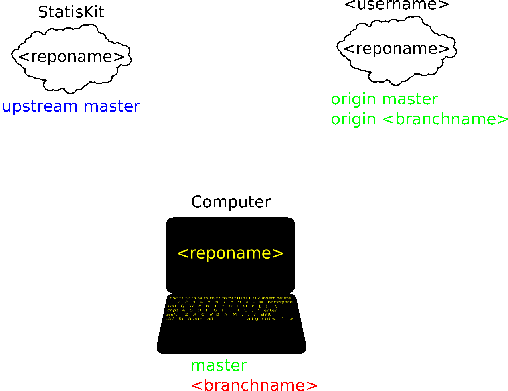

.. Copyright [2017-2018] UMR MISTEA INRA, UMR LEPSE INRA,                ..
..                       UMR AGAP CIRAD, EPI Virtual Plants Inria        ..
.. Copyright [2015-2016] UMR AGAP CIRAD, EPI Virtual Plants Inria        ..
..                                                                       ..
.. This file is part of the StatisKit project. More information can be   ..
.. found at                                                              ..
..                                                                       ..
..     http://statiskit.rtfd.io                                          ..
..                                                                       ..
.. The Apache Software Foundation (ASF) licenses this file to you under  ..
.. the Apache License, Version 2.0 (the "License"); you may not use this ..
.. file except in compliance with the License. You should have received  ..
.. a copy of the Apache License, Version 2.0 along with this file; see   ..
.. the file LICENSE. If not, you may obtain a copy of the License at     ..
..                                                                       ..
..     http://www.apache.org/licenses/LICENSE-2.0                        ..
..                                                                       ..
.. Unless required by applicable law or agreed to in writing, software   ..
.. distributed under the License is distributed on an "AS IS" BASIS,     ..
.. WITHOUT WARRANTIES OR CONDITIONS OF ANY KIND, either express or       ..
.. mplied. See the License for the specific language governing           ..
.. permissions and limitations under the License.                        ..

.. _contribute-upload:

Upload your modifications
=========================

Once you have committed your modifications, you can upload them in your :code:`<username>` `GitHub` account using the :code:`git push` command (see :numref:`workflow-upload-state`).

.. _workflow-upload-state:

    
    Steps of the development branch creation.
    
    Repositories of the same color are synchronized.
    Before the creation of your development branch, all three repositories are not synchronized.
    In:
