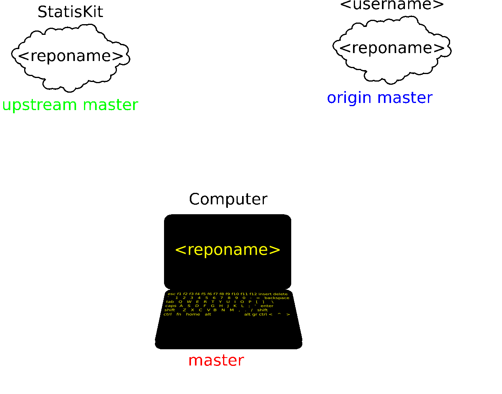

Create a development branch
===========================

In order to enable code review from mainteners, the development must be short (i.e. one branch for one 
task such as new feature, bug fix...).
Moreover, the more the development cycle is long, the more you will risk to  have conflicts.
    
The process of development branch creation is detailed in :numref:`branch-creation` but you can use the equivalent command to create a branch :code:`<branchname>` according to **StatisKit** standards.

.. code-block:: console

    $ statiskit branch <branchname>
    
.. note::
 
    Please choose an explicit name :code:`<branchname>` for your branch.

.. warning::

    After the execution of the :code:`statiskit branch` command, your local repository has switched on the :code:`<branchname>` branch.
    
    .. code-block:: console
    
        $ git branch 
        master
        * <branchname>
        
    But there are, at this point, no differences between the :code:`master` and :code:`<branchname>` branches.
    
    .. code-block:: console
    
        $ git status
        On branch <branchname>
        nothing to commit, working directory clean
        
.. _branch-creation:

    
    Steps of the development branch creation.
    
    Repositories of the same color are synchronized.
    Before the creation of your development branch, all three repositories are not synchronized.
    In:
    
    1. Your local :code:`master` branch is synchronized with the :code:`upstream master` branch.
    
       .. code-block:: console
       
            git checkout master
            git pull upstream master
    
    2. Your remote :code:`origin master` branch is synchronized with your local :code:`master` branch.
 
       .. code-block:: console
       
           git push

    3. Since all your master branches are synchronized, the local :code:`<branchname>` branch is created
    
       .. code-block:: console
       
            git branch <branchname>
            git checkout <branchname>

       Or equivalently
       
       .. code-block:: console
       
            git checkout -b <branchname>

    4. Then, the remote  :code:`origin <branchname>` branch is created in order to enable the uploading of future modifications into your :code:`<username>` `GitHub` account.

       .. code-block:: console

            git push --set-upstream origin <branchname>

.. warning::

    Once this step is done, refers to the :ref:`workflow <contribute-workflow>` to continue.
