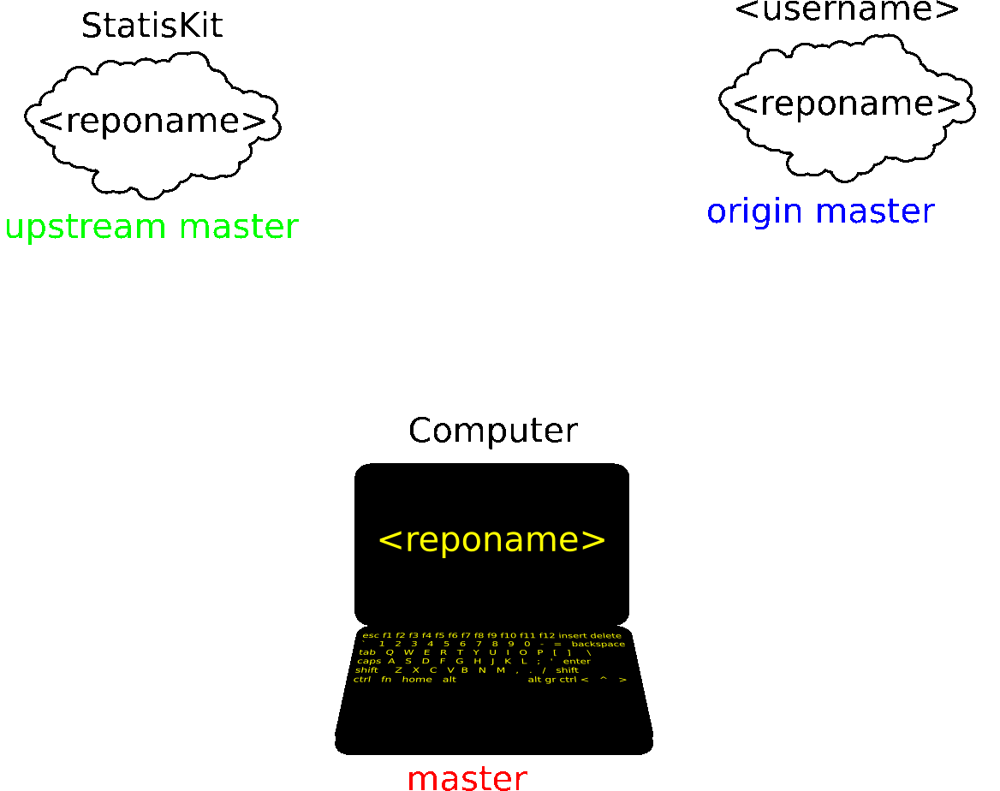

.. ................................................................................ ..
..                                                                                  ..
..  StatisKit: meta-repository providing general documentation and tools for the    ..
..  **StatisKit** Organization                                                      ..
..                                                                                  ..
..  Copyright (c) 2016 Pierre Fernique                                              ..
..                                                                                  ..
..  This software is distributed under the CeCILL-C license. You should have        ..
..  received a copy of the legalcode along with this work. If not, see              ..
..  <http://www.cecill.info/licences/Licence_CeCILL-C_V1-en.html>.                  ..
..                                                                                  ..
..  File authors: Pierre Fernique <pfernique@gmail.com> (26)                        ..
..                                                                                  ..
.. ................................................................................ ..

Contribute to a repository
##########################

When using **Git** you should constently keep in mind the following warning:

.. warning::
    
    Never work on master, always on a branch

In order to contribute to an official repository of **StatisKit** we therefore recommand to follow the following workflow.

.. _contribute-workflow:

.. blockdiag::
    :align: center
    :desctable:
    
    blockdiag {

        A [label = "Branch", shape="roundedbox",
           description="See `Create a development branch`_ section. In order |br|
                        to enable code review from mainteners, the |br|
                        development must be short (i.e. one branch for one |br|
                        task such as new feature, bug fix...)."];
        B [label = "Work", shape="roundedbox",
           description="See `Work on your modifications`_ section. In order |br|
                        to benefit from tools developped by mainteners and |br|
                        ensure code quality, the development must respect |br|
                        some guidelines."];
        C [label = "Commit", shape="roundedbox",
           description="See `Commit your modifications`_ section. Commits |br|
                        are snapshots of the repository. There are useful |br|
                        in particular for versionning software or create |br|
                        backups."];
        D [label = "Upload ?", shape="diamond",
           description="If you want to upload your modifications to your |br|
                        personal repository, you shoud use the :code:`git push` |br|
                        command. Otherwise, you can continue to add |br|
                        commits."];
        E [label = "Finished ?", shape="diamond",
           description="If your work on the branch is done, you should |br|
                        submit your modifications to the official repository. |br|
                        Otherwise, you can continue to add commits."];
        F [label = "Submit", shape="roundedbox",
           description="See `Submit your modifications`_ section. In order |br|
                        to integrate your modifications to the official |br|
                        repository, you must submit your modifications |br|
                        that will be integrated by **StatisKit** mainteners."];
        
        A -> B -> C;
        C -> D;
            
        D -> B;
        E -> B [label = "No"];

        group {
            orientation = portrait;
            color = "#FFFFFF";
            
            D -> E;
            E -> F;
        }
    }

.. |br| raw:: html

    

.. note::

    In the following we assume that you forked the official repository in your personal account and cloned it according to previous recommendations (see :doc:`fork`).

Create a development branch
===========================

    
    Steps of the development branch creation.
    Repositories of the same color are synchronized.
    Before the creation of your development branch, all three repositories are not synchronized.
    In:
    
    1. Your local :code:`master` branch is synchronized with the :code:`upstream master` branch.
    
       .. code-block:: console
       
            git checkout master
            git pull upstream master
    
    2. Your remote :code:`origin master` branch is synchronized with your local :code:`master` branch.
 
       .. code-block:: console
       
           git push

   This is the caption of the figure (a simple paragraph).

   The legend consists of all elements after the caption.  In this
   case, the legend consists of this paragraph and the following
   table:

   +-----------------------+-----------------------+
   | Symbol                | Meaning               |
   +=======================+=======================+
   | .. image:: tent.png   | Campground            |
   +-----------------------+-----------------------+
   | .. image:: waves.png  | Lake                  |
   +-----------------------+-----------------------+
   | .. image:: peak.png   | Mountain              |
   +-----------------------+-----------------------+
   
Since all your master branches are up to date, you can create your local branch

.. code-block:: console

    git checkout -b <branchname>

and push it to your personal repository

.. code-block:: console

    git push --set-upstream origin <branchname>

.. note::

    Please choose an explicit name for your branch.

.. warning::

    Once this step is done, refers to the :ref:`workflow <contribute-workflow>` to continue.

Work on your modifications
==========================

.. warning::

    Once this step is done, refers to the :ref:`workflow <contribute-workflow>` to continue.

Commit your modifications
=========================

.. warning::

    The commit of modifications with **Git** is quite different from **Subversion**.

The *repository index*
----------------------

In **Git**, the *repository index* notion is primordial (see the this `post <http://www.gitguys.com/topics/whats-the-deal-with-the-git-index/>`_ for more details).
In short, files in the *repository index* are files that would be committed to the repository if you used the :code:`git commit` command.
However, files in the *repository index* are not committed to the repository until you use the :code:`git commit` command.
Therefore, in order to commit your modifications you must first build the *repository index* using file additions and removals.
For this step the :code:`git status`, :code:`git add` and :code:`git rm` commands are your friends:

:code:`git status`
    Tells you what files:

    * have been added to the *repository index*,
    * exists in the working tree but are not in the *repository index*,
    * have different contents between the working tree and the *repository index*.

:code:`git add <pathspec>`
    Add the :code:`<pathspec>` file to the repository index.
    
    .. warning::
    
        Contrarily to **Subversion**, with **Git** the :code:`git add` command must be performed not only for adding new files but also for modified files.
        By default no file is added in the index.
       
    For more details, refers to the **Git** manual (:code:`git add --help`).

:code:`git rm <pathspec>`
    Remove the :code:`<pathspec>` file from the working tree and the index.
    For more details, refers to the **Git** manual (:code:`git remove --help`).

    .. note::

        If you do not want to remove the  :code:`<pathspec>` file from you working tree but only in the *repository index* use :code:`git rm --cached <pathspec>` instead.

.. note::

    Since the incremental addition or removal of files can be tidious, the commands :code:`git add -A` can be of most interest.
    This command will also add files that were created.
    Therefore in order to add only relevant files, the :code:`.gitignore` file is of most importance (see :doc:`create`). 

The **Git** Commit
------------------

Once the index is build as desired, it must be committed in order to make another snapshot of the repository.
This is done using the :code:`git commit` command.
If you leave off the :code:`-m` option, this command open your favorite editor (see :doc:`../configuration`) where you can construct a message associated to the commit.
Two commits are distinguished:

Backup & service commits
    These commits are not corresponding to particular development stages and can be used when uploading is a neccessity.
    For example these commits arise when a developper wants to:
    
    * Remotly save his developments.
    * Use a service (see :doc:`create`).

    For this type of commits, please use the :code:`git commit -m "<shortdesc>"` command where :code:`<shortdesc>` is a short summary of the commit.
    This summary should be less that 50 characters.

Developement commits
    The commits are all commits not considered as backup. 
    Please avoid the usage of the :code:`-m` option and produce a nice commit message using the follwing steps (the reader can refer to the `A Better Git Commit <https://web-design-weekly.com/2013/09/01/a-better-git-commit/>`_ message to more informations):

    * The first line should be a short summary.
      Referencing the bug number or the main accomplishment of the change (e.g “Fixes issue #8976″).
      This is the title of your commit and should be less than 50 characters.
      
    * Then a line break.
      
    * Followed by a longer detailed description about the things that changed.
      This section is a really good place to explain what and why.
      You could cover statistics, performance wins, roadblocks, etc. The text should be wrapped at 72 characters.

.. note::

    If you want to add to your index deleted or modified files when committing, you can use the :code:`-a` flag.
    The command

    .. code-block:: console
    
        git commit -a

    is used for automatically staged files that have been modified and deleted, but new files you have not told **Git** about are not affected.
    In this fact this command is different from the commands

    .. code-block:: console

        git add -A
        git commit

    that will also add new files.

.. warning::

    Once this step is done, refers to the :ref:`workflow <contribute-workflow>` to continue.

Submit your modifications
=========================

Prepare your pull-request
-------------------------

Before submitting your modifications, you must recover changes from :code:`upstream master` remote branch in your local :code:`master` branch

.. code-block:: console

        git checkout master
        git pull upstream master

and upload the changes in your :code:`origin master` remote branch

.. code-block:: console

        git push
        
Then, you must rebase your local development branch with your local :code:`master` branch.

.. code-block:: console

        git checkout <branchname>
        git rebase master

If conflicts occur, fix conflicts for each file and finish rebase

.. code-block:: console

        git rebase --continue

.. note::

    Any file modified when fixing conflicts should be added using the :code:`git add <pathspec>` command.

If anything has gone wrong, you can abort reabase

.. code-block:: console

        git rebase --abort

Create your pull-request
------------------------

On github interface, select your branch :code:`<branchname>` and click on pull-request (see this `post <https://help.github.com/articles/using-pull-requests/>`_ for more details).

.. warning::

    You must see the following message: "Able to merge. These branches can be automatically merged".
    If it's not the case, the :code:`upstream master` has probably diverged.
    You must therefore turn back to previous step (see `Prepare your pull-request`_ section).

If all steps described in the workflow are respected, your branch is clean and mainteners have absolutely nothing to do to integrate your work (except to review your changes) and so it will certainly be integrated.

.. note::

    Once your branch is integrated in the :code:`upstream master`, it is recommanded to to delete your branch:

    * On your local repository,

      .. code-block:: console
      
            git checkout master
            git branch -d <branchname>

    * On your personal repository,

      .. code-block:: console
      
            git push origin --delete <branchname>

.. warning::

    Once this step is done, refers to the :ref:`workflow <contribute-workflow>` to continue.

.. MngIt

.. |NAME| replace:: StatisKit

.. |BRIEF| replace:: meta-repository providing general documentation and tools for the **StatisKit** Organization

.. |VERSION| replace:: v0.1.0

.. |AUTHORSFILE| replace:: AUTHORS.rst

.. _AUTHORSFILE : AUTHORS.rst

.. |LICENSENAME| replace:: CeCILL-C

.. |LICENSEFILE| replace:: LICENSE.rst

.. _LICENSEFILE : LICENSE.rst

.. MngIt
