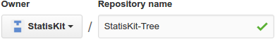

.. ................................................................................ ..
..                                                                                  ..
..  StatisKit: meta-repository providing general documentation and tools for the    ..
..  **StatisKit** Organization                                                      ..
..                                                                                  ..
..  Copyright (c) 2016 Pierre Fernique                                              ..
..                                                                                  ..
..  This software is distributed under the CeCILL-C license. You should have        ..
..  received a copy of the legalcode along with this work. If not, see              ..
..  <http://www.cecill.info/licences/Licence_CeCILL-C_V1-en.html>.                  ..
..                                                                                  ..
..  File authors: Pierre Fernique <pfernique@gmail.com> (17)                        ..
..                                                                                  ..
.. ................................................................................ ..

Create a new repository
#######################

.. warning::
    
    Only owners of the **StatisKit** organization can create new repositories.

Initialize the repository
=========================

The initialization of a repository is first made on GitHub (see this `page <https://help.github.com/articles/create-a-repo/>`_ for more details).
First go to the **StatisKit** `organization page <https://github.com/StatisKit>`_ and click on the |NEWBUTTON|.

This will lead you to a page where you must fill the following two fields:

* |REPOSITORYNAME| with a short, memorable and explicit name.
  For repositories that are concerning statistical methods, the name must begin with :code:`StatisKit-`.
  For instance :code:`StatisKit-Core` denote a repository that contains basic statistical classes and methods (dataframes, classical univariate and multivariate distributions or regressions) that will be used in repositories containing more complex statistical methodology (e.g. :code:`StatisKit-Tree`).
* |REPOSITORYDESC| with a short and explicit description of the repository purposes.
Once these both steps done, click on |CREATEBUTTON|.

.. warning::

    At this point:
    
    * Do not add a README (|READMEBOX|).
    * Do not select a :code:`.gitignore` file (|GITIGNOREMENU|). 
    * Do not select a license (|LICENSEMENU|).

.. |NEWBUTTON| image:: plus_new_repository_button.png
               :scale: 100%
               :alt: the new repository button

.. |LICENSEMENU| image:: add_license_menu.png
                 :scale: 100%
                 :alt: the license menu set to :code:`None`
                 
.. |REPOSITORYDESC| image:: repository_desc.png
                    :scale: 100%
                    :alt: the repository description field

Complete the repository
=======================

For now your repository is empty and you will need to complete it in order to respect **StatisKit** standards.
For instance, let consider that you initialized a repository denoted by :code:`<repository>`, then you must open a terminal and

1. Clone the **GitHub** repository
   
   .. code-block:: console
   
        git clone git@github.com:StatisKit/<repository>.git

2. Enter in local repository directory

   .. code-block:: console

        cd <repository>

3. Run the following shell :download:`script <repository.sh>`

   .. code-block:: console

        wget statiskit.readthedocs.io/en/latest/developper/public/repository.sh
        bash repository.sh

   This script requires the **MngIt** package and execute the following commands
   
   .. literalinclude:: repository.sh
      :language: bash
      :linenos:

4. Remove the local repository
   
   .. code-block:: console

        cd ..
        rm -rf <repository>

Activate repository services
============================

.. MngIt

.. |NAME| replace:: StatisKit

.. |BRIEF| replace:: meta-repository providing general documentation and tools for the **StatisKit** Organization

.. |VERSION| replace:: v0.1.0

.. |AUTHORSFILE| replace:: AUTHORS.rst

.. _AUTHORSFILE : AUTHORS.rst

.. |LICENSENAME| replace:: CeCILL-C

.. |LICENSEFILE| replace:: LICENSE.rst

.. _LICENSEFILE : LICENSE.rst

.. MngIt
