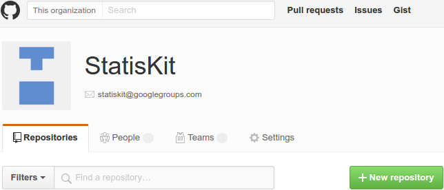
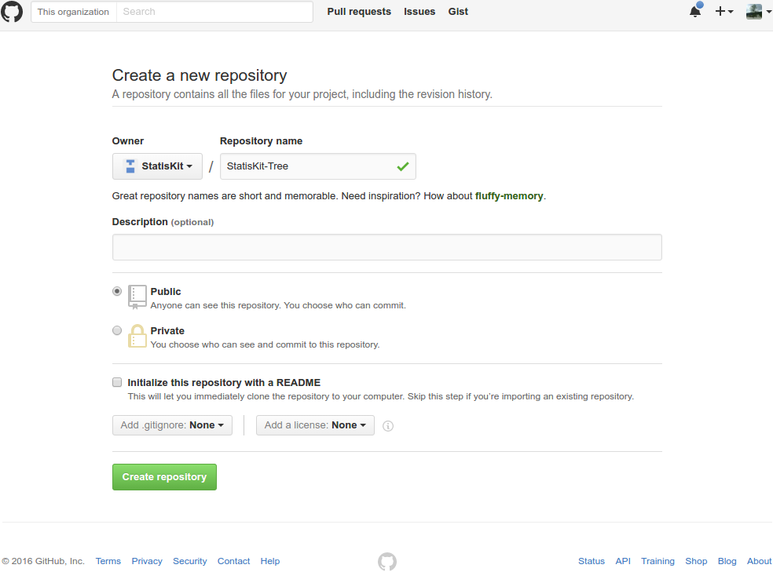

.. ................................................................................ ..
..                                                                                  ..
..  StatisKit: meta-repository providing general documentation and tools for the    ..
..  **StatisKit** Organization                                                      ..
..                                                                                  ..
..  Copyright (c) 2016 Pierre Fernique                                              ..
..                                                                                  ..
..  This software is distributed under the CeCILL-C license. You should have        ..
..  received a copy of the legalcode along with this work. If not, see              ..
..  <http://www.cecill.info/licences/Licence_CeCILL-C_V1-en.html>.                  ..
..                                                                                  ..
..  File authors: Pierre Fernique <pfernique@gmail.com> (4)                         ..
..                                                                                  ..
.. ................................................................................ ..

Create a new repository
#######################

.. warning::
    
    Only owners of the **StatisKit** organization can create new repositories.

Initialize the repository
=========================

The initialization of a repository is first made on `GitHub <https://help.github.com/articles/create-a-repo/>`_ by clicking on the |NEWBUTTON| button of the **StatisKit** `organization page <https://github.com/StatisKit>`_ (see :numref:`organization_page`).

.. |NEWBUTTON| image:: plus_new_repository_button.png
                  :alt: the new repository button

.. _organization_page:

   Partial snapshot of the **StatisKit** organization repository page.

   The |NEWBUTTON| is located at above the repository list of the **StatisKit** organization repository page.

|CREATEBUTTON| |GITIGNOREMENU|  |LICENSEMENU| 

For repositories that are concerning statistical methods, the name must begin with :code:`StatisKit-` and preceded by  a short, memorable and explicit name.
For instance :code:`StatisKit-Core` denote a repository that contains basic statistical classes and methods (dataframes, classical univariate and multivariate distributions or regressions) that will be used in repositories containing more complex statistical methodology (e.g. :code:`StatisKit-Tree`).

.. |CREATEBUTTON| image:: create_repository_button.png
                  :alt: the create repository button

.. |GITIGNOREMENU| image:: add_gitignore_menu.png
                   :alt: the ignore menu set to :code:`None`

.. |LICENSEMENU| image:: add_license_menu.png
                 :alt: the license menu set to :code:`None`

.. warning::

    At this point:
    
    * Do not tick the :code:`Initialize this repository with a README` box.
    * Do not add a :code:`.gitignore` file. 
    * Do not select a license.

Your screen should look like the following image:

    Initialization of a new repository (e.g. :code:`StatisKit-Tree).

.. warning::

    At this point:
    
    * Do not tick the :code:`Initialize this repository with a README` checkbox.
    * Do not add a :code:`.gitignore` file. 
    * Do not select a license.

.. note::

    **StatisKit** organization do not support private repositories.

You can proceed by clicking on the :code:`Create repository` button.

Complete the repository
=======================

For now your repository is empty 

.. code-block:: bash

    cd ~/Desktop

.. code-block:: bash

    git clone git@github.com:StatisKit/StatisKit-Tree.git

.. code-block:: bash

    cd StatisKit-Tree
    mkdir doc
    touch doc/index.rst
    mkdir src
    touch README.rst
    git add doc README.rst
    git commit -m 'Add the repository'

.. code-block:: bash

    mngit init --name=StatisKit-Tree --brief=Statistical analysis of tree-indexed data

.. code-block:: bash

    mngit authors
    mngit version
    mngit license --plugin=CeCILL-C
    mngit rst
    mngit sphinx
    mngit update

.. code-block:: bash

    git add AUTHORS.rst LICENSE.rst
    git commit -a --amend --no-edit

.. code-block:: bash

    git push

.. code-block:: bash

    cd ..
    rm -rf StatisKit-Tree

Activate repository services
============================

.. MngIt

.. |NAME| replace:: StatisKit

.. |BRIEF| replace:: meta-repository providing general documentation and tools for the **StatisKit** Organization

.. |VERSION| replace:: v0.1.0

.. |AUTHORSFILE| replace:: AUTHORS.rst

.. _AUTHORSFILE : AUTHORS.rst

.. |LICENSENAME| replace:: CeCILL-C

.. |LICENSEFILE| replace:: LICENSE.rst

.. _LICENSEFILE : LICENSE.rst

.. MngIt
