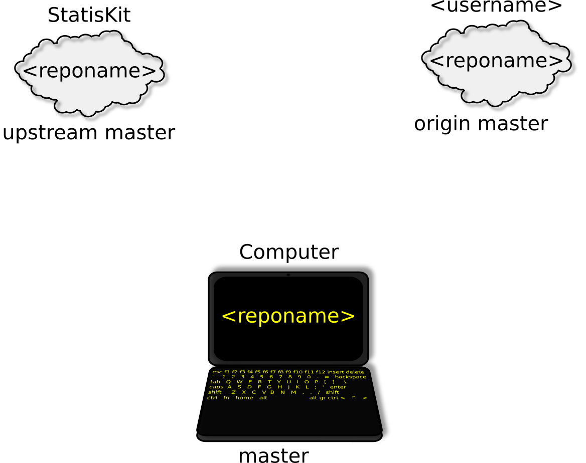

.. ................................................................................ ..
..                                                                                  ..
..  StatisKit: meta-repository providing general documentation and tools for the    ..
..  **StatisKit** Organization                                                      ..
..                                                                                  ..
..  Copyright (c) 2016 Pierre Fernique                                              ..
..                                                                                  ..
..  This software is distributed under the CeCILL-C license. You should have        ..
..  received a copy of the legalcode along with this work. If not, see              ..
..  <http://www.cecill.info/licences/Licence_CeCILL-C_V1-en.html>.                  ..
..                                                                                  ..
..  File authors: Pierre Fernique <pfernique@gmail.com> (8)                         ..
..                                                                                  ..
.. ................................................................................ ..

Fork and/or clone a repository
##############################

To fork and/or clone a repository of the **StatisKit** organization, we recommend to use the :code:`statiskit clone` command.
To perform these steps, :code:`statiskit clone` uses the PyGithub package to access `GitHub` interface in `Python`.
Your gitHub credentials (<username> and <password>) are therefore required .

.. code-block:: console

    $ statiskit clone
    Username for 'https://github.com': <username>
    Password for 'https://pfernique@github.com': <password>
    
Let us consider a repository identified by :code:`<reponame>`

.. code-block:: console

    Enter a repository name: <reponame>
    
This command:

1. Fork the :code:`<reponame>` into your account.

   .. warning::
   
        The :code:`<reponame>` must exists in the **StatisKit** organization.

   .. note::
        
        If you already forked the :code:`<reponame>` it will not be forked one more time.

2. Clone it on your disk at your current location within the :code:`<reponame>` directory.

   .. warning::

        If your fork of the :code:`<reponame>` repository is not named :code:`<reponame>`, Its name will be used in place of :code:`<reponame>` for the directory that contains the clone.
        
    
   .. note::
    
        By default, the clone is performed using SSH remote url. 
        If you prefer to use the HTTPS remote url, use the :code:`url` argument of the :code:`statiskit clone` command:
        
        .. code-block:: console
        
            $ statiskit clone --url=https
        
3. Add the :code:`upstream` remote that refers to the repository on the **StatisKit** organization.
   
   .. note::
   
        By default, the :code:`origin` remote refers to the repository on your account.
    
    

    
    Repository status after fork and clone of a repository. 
    
    The repository is named :code:`<reponame>`.
    The left hand cloud represents the repository on the **StatisKit** organization `GitHub` account. 
    The right hand clound represents the forked repository on your :code:`<username>` `GitHub` account.
    The computer represents the cloned repository on your computer.
    Considering that you are on the :code:`master` branch on your computer you can compare your local branch to remote branches using:
    
    * for the remote branch on the **StatisKit** `GitHub` account,
    
      .. code-block:: console
    
        $ git diff upstream/master 
        
    * for the remote branch on your :code:`<username>` `GitHub` account,
    
      .. code-block:: console
    
        $ git diff origin/master
        
      Or, since :code:`origin` is chosen by default,
      
      .. code-block:: console
    
        $ git diff master
        
    Test
    
.. MngIt

.. |NAME| replace:: StatisKit

.. |BRIEF| replace:: meta-repository providing general documentation and tools for the **StatisKit** Organization

.. |VERSION| replace:: v0.1.0

.. |AUTHORSFILE| replace:: AUTHORS.rst

.. _AUTHORSFILE : AUTHORS.rst

.. |LICENSENAME| replace:: CeCILL-C

.. |LICENSEFILE| replace:: LICENSE.rst

.. _LICENSEFILE : LICENSE.rst

.. MngIt
